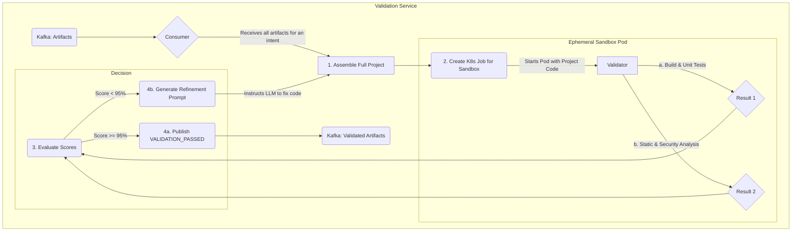

# QLP - Key Architectural Views

This document provides detailed diagrams for specific, critical sub-systems and workflows within the QLP platform.

## 1. AITL Validation & Self-Critique Loop

This diagram illustrates the process by which the system validates and iteratively improves its own generated code.

### Flow Description

1.  **Assembly:** The Validation Service consumes all `CODE_GENERATED`, `TESTS_GENERATED`, etc. events for a specific job from the `Artifacts` topic. It assembles these files into a complete, runnable project structure.
2.  **Sandboxing:** It creates a dedicated Kubernetes `Job` to run the validation in a secure, ephemeral pod. The pod contains the full assembled project.
3.  **Holistic Testing:** Inside the sandbox, the project is built, unit tests are run, and a battery of static analysis and security scans are performed.
4.  **Decision & Refinement:**
    - If all scores meet the high threshold (e.g., 95%), a `VALIDATION_PASSED` event is published.
    - If the scores are too low, the service generates a "refinement prompt" detailing all the failures. It then re-enters the loop at Step 1, using the refinement prompt to have an LLM fix the code. This loop continues until the score passes or a maximum number of attempts is reached. 